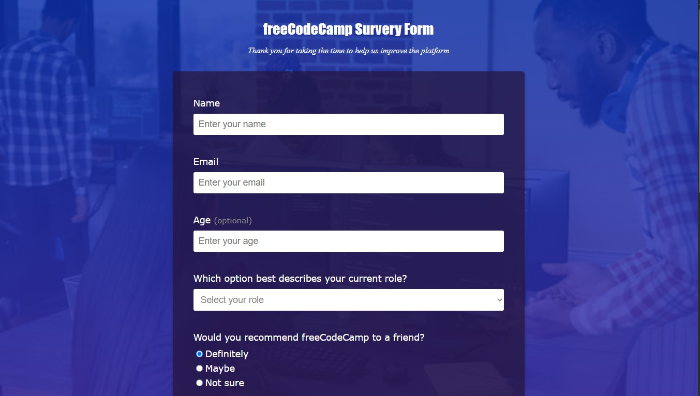

# freeCodeCamp Survey Form

This project is a **Survey Form** built as part of the Responsive Web Design Course at [freeCodeCamp](https://www.freecodecamp.org/). It demonstrates the use of modern HTML5 and CSS3 to create a responsive, accessible, and visually appealing web form.

## Features

- Responsive layout for desktop and mobile devices
- Custom background with a semi-transparent form container
- Accessible form elements with proper labels
- Various input types: text, email, number, radio buttons, checkboxes, dropdowns, and textarea
- Styled with CSS for a clean and modern look

## Project Structure

```
index.html
assets/
  styles.css
  img/
    background.png
```

- `index.html`: Main HTML file containing the survey form
- `assets/styles.css`: CSS file for styling the form and layout
- `assets/img/background.png`: Background image used in the form

## How to Use

1. Clone or download this repository.
2. Open `index.html` in your web browser.
3. Fill out the survey form and explore the responsive design.

## Screenshots



## Credits

- Built by [Calson] while taking the Responsive Web Design Course at [freeCodeCamp](https://www.freecodecamp.org/certification/fccc542f13f-414a-4555-9773-cc51881c47b1/responsive-web-design).

## Contact

- **WhatsApp:** 681849054 or 678112223  
- **Email:** cooljimmy974@gmail.com

## License

This project is for educational purposes.
